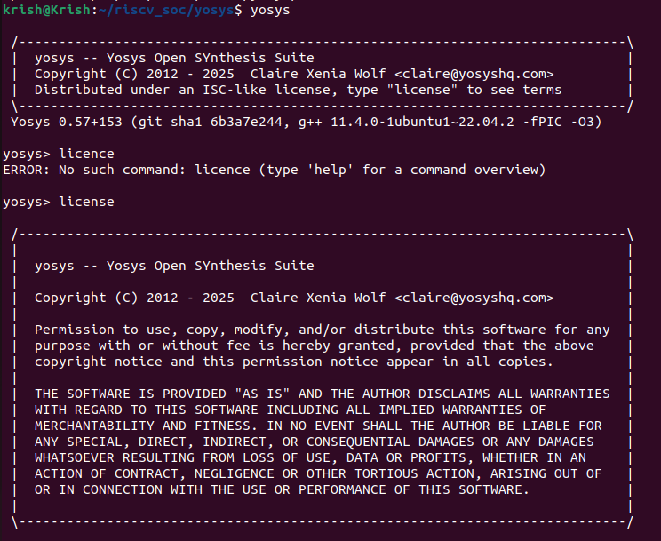
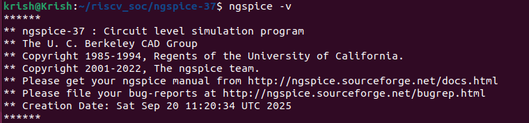

# 🚀 VLSI Open-Source Tools Setup

This repository documents the setup and usage of **open-source VLSI tools** as per the given assignment tasks.  
It includes tool installation instructions, task-wise documentation, and proof snapshots.

---

## Table of Contents

| Week  | Tools / Sections |
|-------|-----------------|
| 0     | - [Yosys](#yosys)<br>- [Icarus Verilog](#icarus-verilog)<br>- [GTKWave](#gtkwave)<br>- [ngspice](#ngspice)<br>- [Magic](#magic)<br>- [Docker](#docker)<br>- [OpenLane](#openlane) |

### ** System Prerequisites**

-   *System Requirements: 4 vCPU, 6 GB RAM, 50 GB HDD, **Ubuntu 20.04* or higher.

## Week-0

### Yosys
```bash
sudo apt-get update
git clone https://github.com/YosysHQ/yosys.git
cd yosys
sudo apt install make
sudo apt-get update
sudo apt-get install -y build-essential clang bison flex libreadline-dev gawk tcl-dev libffi-dev git graphviz xdot pkg-config python3 libboost-system-dev libboost-python-dev libboost-filesystem-dev zlib1g-dev
git submodule update --init --recursive
make config-gcc
make
sudo make install 
```


### Icarus Verilog
```bash
sudo apt-get update
sudo apt-get install iverilog
```


### GTKWave
```bash
sudo apt-get update 
sudo apt install gtkwave
```


### ngspice
```bash
tar -zxvf ngspice-37.tar.gz
cd ngspice-37
mkdir release
cd release
../configure --with-x --with-readline=yes --disable-debug
make
sudo make install
```


### Magic
```bash
sudo apt-get install m4 tcsh csh libx11-dev tcl-dev tk-dev libcairo2-dev mesa-common-dev libglu1-mesa-dev libncurses-dev
git clone https://github.com/RTimothyEdwards/magic
cd magic
./configure
make
sudo make install
```


### Docker
```bash
sudo apt-get update
sudo apt-get upgrade
sudo apt install -y build-essential python3 python3-venv python3-pip make git
sudo apt install apt-transport-https ca-certificates curl software-properties-common
curl -fsSL https://download.docker.com/linux/ubuntu/gpg | sudo gpg --dearmor -o /usr/share/keyrings/docker-archive-keyring.gpg
echo "deb [arch=amd64 signed-by=/usr/share/keyrings/docker-archive-keyring.gpg] https://download.docker.com/linux/ubuntu $(lsb_release -cs) stable" | sudo tee /etc/apt/sources.list.d/docker.list > /dev/null
sudo apt update
sudo apt install docker-ce docker-ce-cli containerd.io
sudo docker run hello-world
sudo groupadd docker
sudo usermod -aG docker $USER
sudo reboot
```
# After reboot
docker run hello-world


### OpenLane
```bash
cd $HOME
git clone https://github.com/The-OpenROAD-Project/OpenLane
cd OpenLane
make
make test
```
### 🌟 *Key Learnings from Week 0*

-   Successfully installed and verified the complete *open-source EDA tools* ecosystem.
-   Mastered *environment setup* for professional RTL design and synthesis workflows.
-   Established a *Docker-based OpenLane environment* for automated and reproducible design flows.
-   Configured a virtual machine (or WSL) with optimal specifications for EDA workloads.

